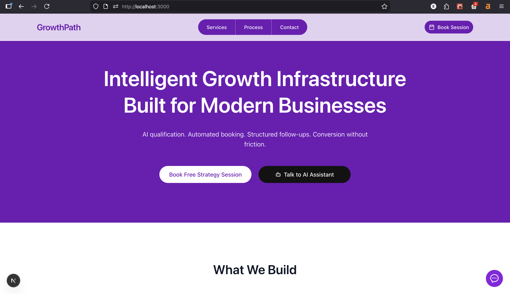
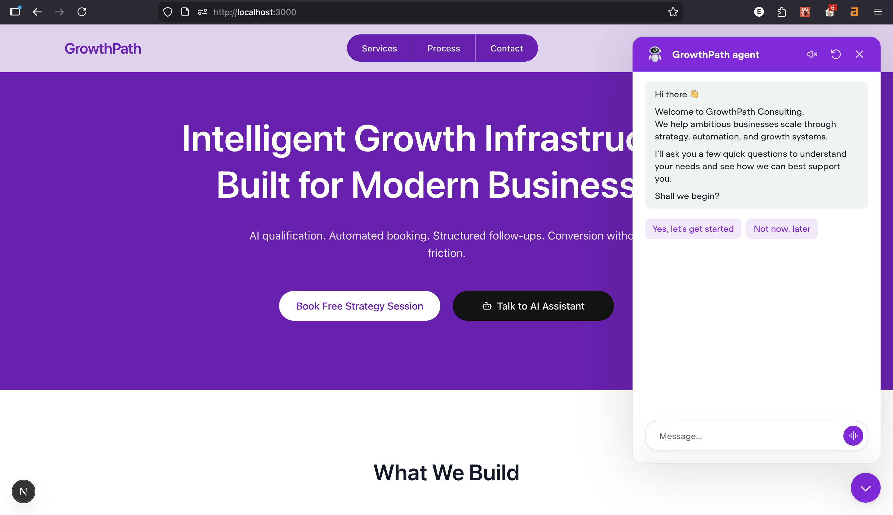
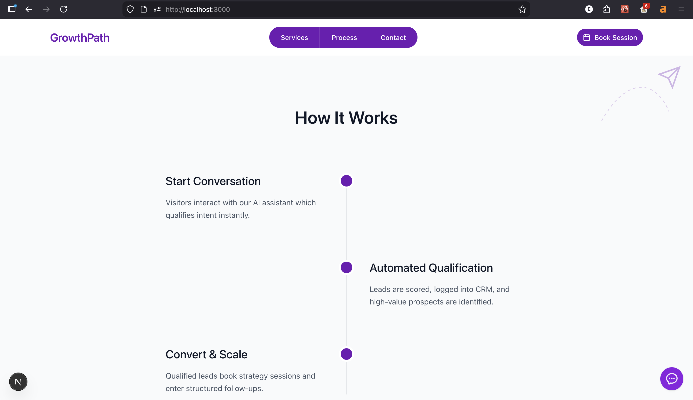
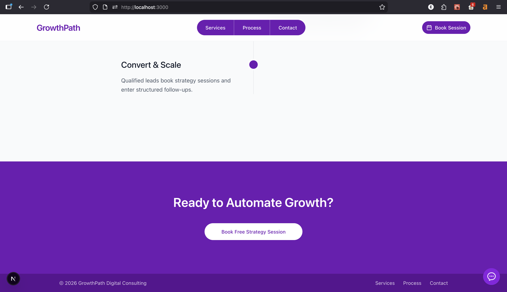

# GrowthPath Landing Page

A modern marketing landing page built with **Next.js 16+, Tailwind CSS, Framer Motion, shadcn/ui, and Lucide icons**.

This project presents the GrowthPath AI-powered lead qualification system with integrated Voiceflow chat support.

---

## 🚀 Tech Stack

- Next.js 16+
- TypeScript
- Tailwind CSS
- Framer Motion
- shadcn/ui
- Lucide React
- Voiceflow Web Chat Widget

---

## 📦 Installation

Clone the repository and install dependencies:

```bash
npm install
```

Run the development server:

```bash
npm run dev
```

Open your browser:

```
http://localhost:3000
```

---

## 🧠 Features

- Fully responsive layout
- Modern segmented desktop navigation
- Animated mobile dropdown menu
- Framer Motion entrance animations
- Structured “What We Build” grid system
- Interactive vertical timeline (How It Works)
- Integrated Voiceflow chatbot
- Unified CTA logic (all buttons trigger chatbot)
- Clean brand color system (#7018B4)

---

## 💬 Voiceflow Integration

The Voiceflow widget loads dynamically inside `page.tsx`:

```ts
(window as any).voiceflow?.chat?.load({
  verify: { projectID: "YOUR_PROJECT_ID" },
  url: "https://general-runtime.voiceflow.com",
  versionID: "production",
});
```

All CTA buttons trigger:

```ts
(window as any).voiceflow?.chat?.open?.();
```

---

## 📁 Project Structure

```
growthpath-landing/
├── app/                 # Next.js App Router (pages, layout, metadata)
├── components/          # Reusable UI components (shadcn + custom)
├── lib/                 # Utility functions and helpers
├── public/              # Static assets (icons, images, favicon)
├── components.json      # shadcn configuration
├── eslint.config.mjs    # ESLint configuration
├── next.config.ts       # Next.js configuration
├── next-env.d.ts        # Next.js TypeScript definitions
├── postcss.config.mjs   # PostCSS configuration
├── tsconfig.json        # TypeScript configuration
├── package.json         # Project dependencies and scripts
├── package-lock.json    # Dependency lock file
└── README.md            # Project documentation
```

---

## 🎨 Design System

Primary Brand Color:

```
#7018B4
```

### Design Philosophy

- Clean modern SaaS aesthetic
- Structured layouts
- Minimal shadows
- Strong visual hierarchy
- Subtle motion transitions
- Mobile-first responsiveness

---

## 📱 Responsiveness

- Mobile-first layout
- Equal-width stacked CTAs on mobile
- Segmented navigation on desktop
- Animated dropdown for small screens
- Optimized spacing across breakpoints

---

---

## 📸 Screenshots

<p align="center">
  
  
</p>

<p align="center">
  
  
</p>

<p align="center">
  
</p>

---

## 🛠 Production Build

```bash
npm run build
npm start
```

---

## 👤 Author

Bamiduro Eniola G. (GBT3K)